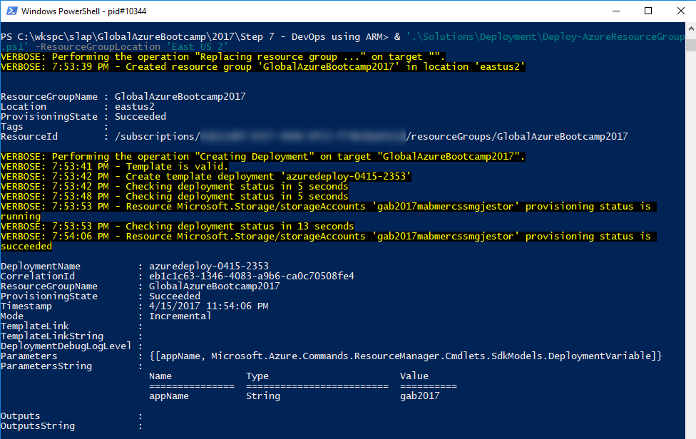
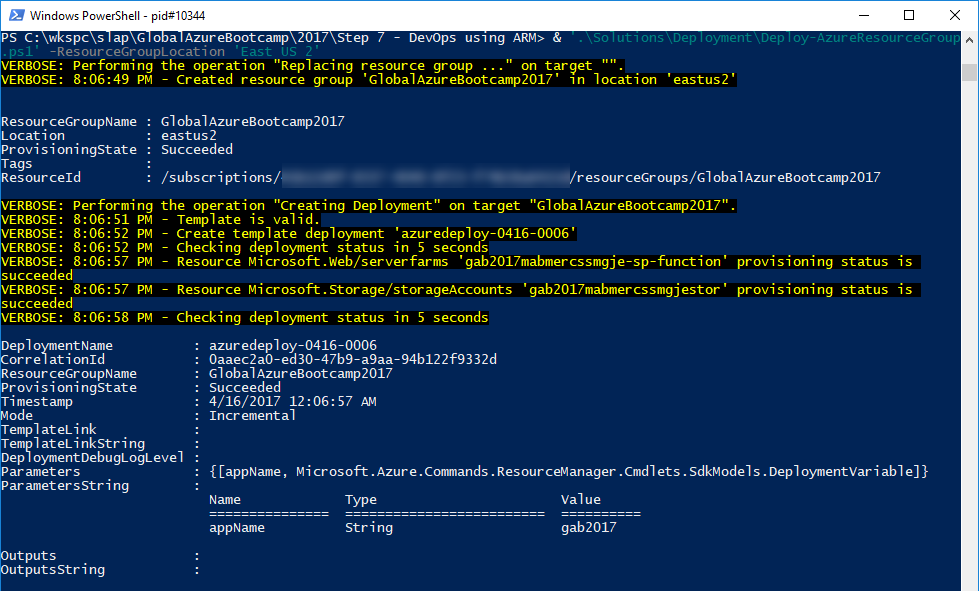
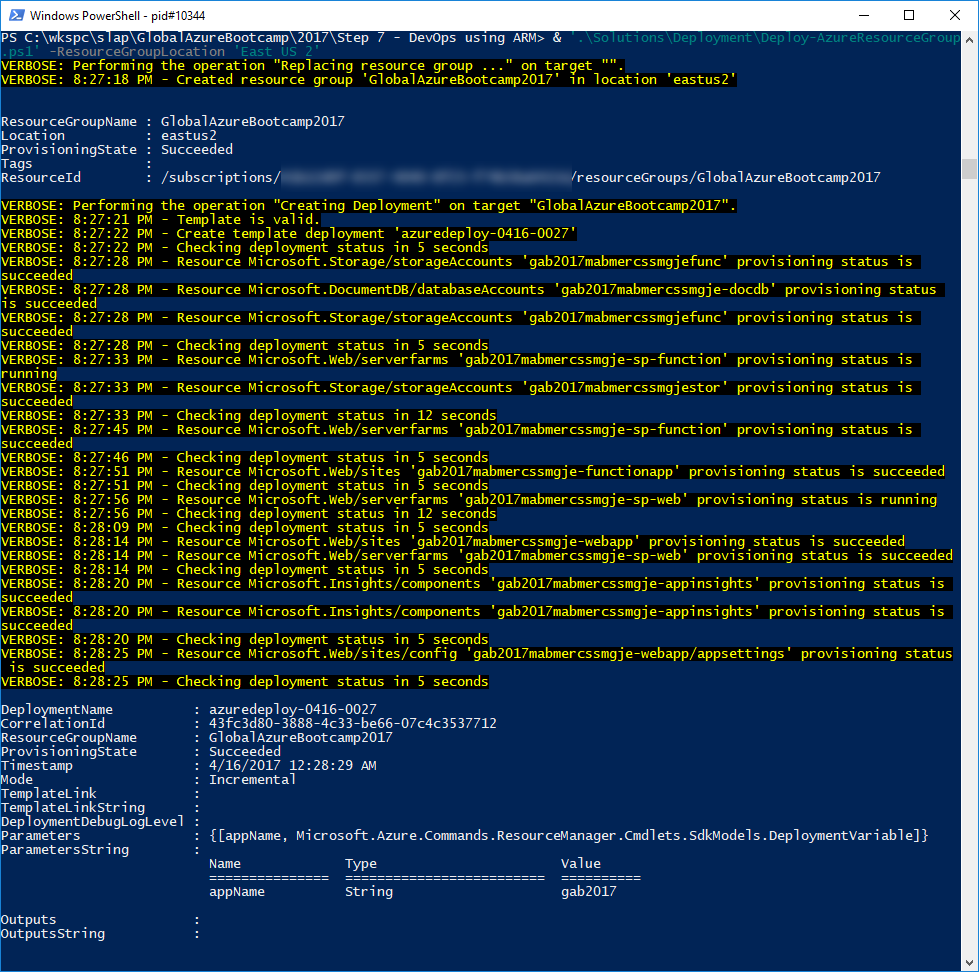

# Goal
Automate the creation of the resources required by the application in Azure using Infrastructure as Code (IaC) using Visual Studio Resource Group project. For doing that, we'll start from an empty resource group template project in Visual Studio and add to it to cover all the Azure resources found in the previous steps.

> **!! Important !!**: in under 40 minutes for an instructor led demo, we cannot cover both IaC & code deployments. Only IaC will be covered in this step.

# Requirements
* Azure PowerShell v3.7.0 or later. Get it [here](https://github.com/Azure/azure-powershell/releases/tag/v3.7.0-March2017).

# Reference
* https://docs.microsoft.com/en-us/azure/azure-resource-manager/resource-group-overview
* https://docs.microsoft.com/en-us/azure/azure-resource-manager/resource-manager-create-first-template

# Some background
Use the following links to learn or refresh your memory about Azure Resource Manager templates.
Head to :
* https://docs.microsoft.com/en-us/azure/azure-resource-manager/resource-manager-create-first-template
* https://docs.microsoft.com/en-us/azure/azure-resource-manager/vs-azure-tools-resource-groups-deployment-projects-create-deploy

# Let's code!
## Login in to Azure and select the right subscription
0. Ask the attendees to log into Azure and select the right Azure Subscription

    0. Open a PowerShell window
    0. Change the directory to the DevOps step directory. `cd '{RepositoryPath}\2017\Step 7 - DevOps using ARM'`
    0. Login-AzureRmAccount
    0. Select-AzureRmSubscription -SubscriptionName '{SubscriptionName}'

## Add the generic storage account
0. Ask the attendees to open the file 1.json in the *Code Snippets folder*. Copy an paste the code from the `templateFile` members (parameters, variables, resources) into `Solutions\Deployment\azuredeploy.json`.
0. Ask the attendees to open the file 1.json in the *Code Snippets folder*. Copy an paste the code from the `parameterFile` `parameters` member into `Solutions\Deployment\azuredeploy.parameters.json`.
0. Ask to save both files and call `& '.\Solutions\Deployment\Deploy-AzureResourceGroup.ps1' -ResourceGroupLocation 'East US 2'`

## Add function App Service Plan
> In order to compensate an issue with Function Apps at the time of writting this, if you want a dynamic App Service plan  in a resource group, it need to be created first before any other static/regular App Service Plan, this is a workaround and the issue is already known by the product team.

0. Ask the attendees to open the file 2.json in the *Code Snippets folder*. Copy an paste the code from the `templateFile` members (variables, resources) into `Solutions\Deployment\azuredeploy.json`.
0. Ask to save template file and call `& '.\Solutions\Deployment\Deploy-AzureResourceGroup.ps1' -ResourceGroupLocation 'East US 2'`

## Add web application
0. Ask the attendees to open the file 3.json in the *Code Snippets folder*. Copy an paste the code from the `templateFile` members (variables, resources) into `Solutions\Deployment\azuredeploy.json`.
0. Ask to save template file and call `& '.\Solutions\Deployment\Deploy-AzureResourceGroup.ps1' -ResourceGroupLocation 'East US 2'`

## Add function application
0. Ask the attendees to open the file 4.json in the *Code Snippets folder*. Copy an paste the code from the `templateFile` members (variables, resources) into `Solutions\Deployment\azuredeploy.json`.

    **!! Take great care of replacing the whole `storage` variable with the new snippet content.**
0. Ask to save template file and call `& '.\Solutions\Deployment\Deploy-AzureResourceGroup.ps1' -ResourceGroupLocation 'East US 2'`

## Add DocumentDB 
0. Ask the attendees to open the file 5.json in the *Code Snippets folder*. Copy an paste the code from the `templateFile` members (variables, resources) into `Solutions\Deployment\azuredeploy.json`.
0. Ask to save template file and call `& '.\Solutions\Deployment\Deploy-AzureResourceGroup.ps1' -ResourceGroupLocation 'East US 2'`

## Add Application Insights 
0. Ask the attendees to open the file 5.json in the *Code Snippets folder*. Copy an paste the code from the `templateFile` members (variables, resources) into `Solutions\Deployment\azuredeploy.json`.

    **!! Take great care of replacing the whole `WebApp` resource with the new snippet content.**

0. Ask to save template file and call `& '.\Solutions\Deployment\Deploy-AzureResourceGroup.ps1' -ResourceGroupLocation 'East US 2'`

# End